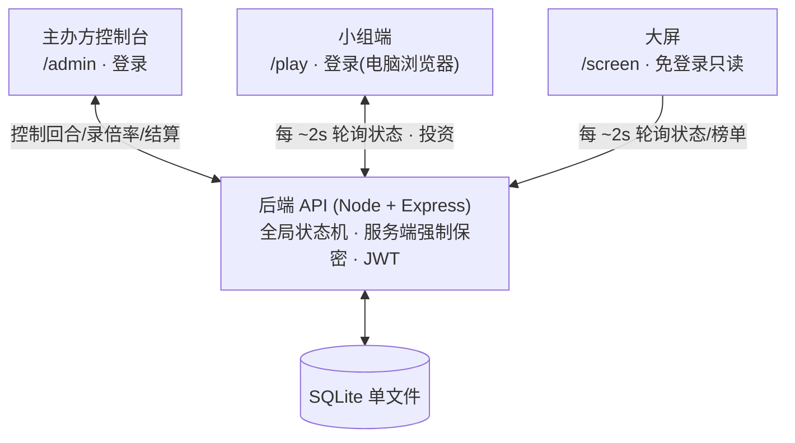
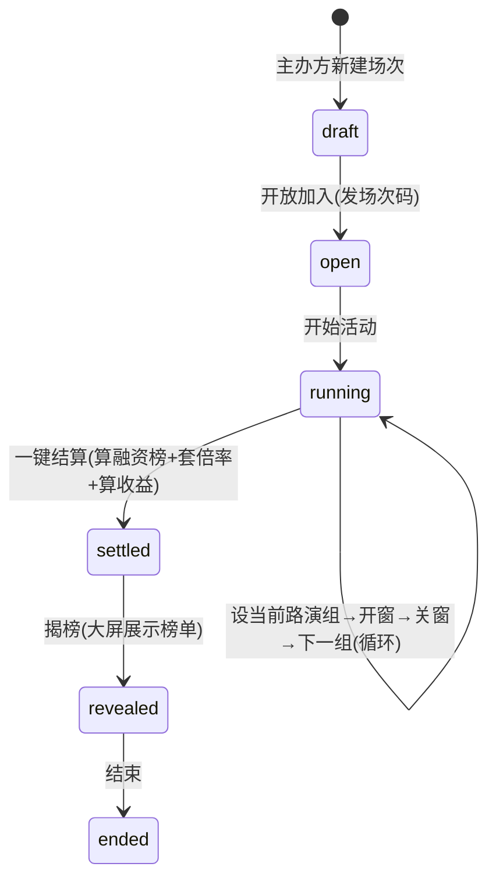
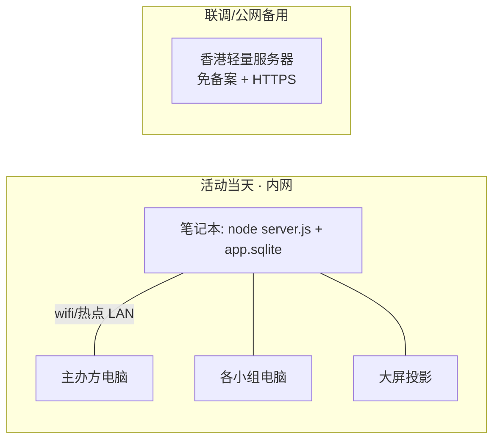

# 02 · 系统架构

## 1. 总体架构

三个前端界面通过 HTTP 轮询与单个后端通讯,后端读写一个 SQLite 文件。回合状态机与金额保密都在后端强制。

- 小组端、大屏用**轮询**(每 ~2 秒)同步全局状态;不使用 WebSocket(会场网络抖动时轮询更稳,本规模足够)。
- 同一个 Express 进程既提供 API,也托管前端 `vite build` 出的静态文件 —— 最终交付物是**单个 Node 进程 + 一个 .sqlite 文件**。

## 2. 技术选型

| 层 | 选型 | 理由 |
|---|---|---|
| 后端 | Node.js + Express + `better-sqlite3` | 单进程、零配置、内网易部署 |
| 数据库 | SQLite(单文件) | 10 组 + 数百条记录绰绰有余,备份就是拷文件 |
| 鉴权 | JWT(密钥放 env)+ bcrypt | 无状态,简单 |
| 前端 | React + Vite + Tailwind | 与设计稿一致,三入口 SPA |
| 实时 | HTTP 轮询 ~2s | 简单、抗弱网 |

前端三个入口(可为同一 SPA 的不同路由):`/admin`(主办方)、`/play`(小组)、`/screen`(大屏,带 `?session=<id>` 或路径参数)。

## 3. 全局状态机(每场次一份运行时状态)

主办方驱动,小组/大屏跟随。运行时状态存在 `sessions` 行上(见 `03-data-model.md`):`status`、`current_target_id`、`window_open`、`current_round`、`revealed`。

- 投资只在 `status=running` 且 `window_open=1` 且 `target=current_target_id` 时被接受。
- 评审倍率可在 `running` 阶段**任意时间**录入(与回合并行),结算时只对融资前 N 名生效。

## 4. 金额保密(服务端强制)

- 小组相关接口**只返回该组自己的余额和投资**,永不下发别组金额。
- 融资总额、排名等聚合数据,**仅在 `revealed=1` 后**通过大屏/榜单接口暴露。
- 不能依赖前端隐藏;所有过滤在后端完成。

## 5. 部署(国内场景)

- **当天主力 = 内网**:会场一台笔记本跑服务,所有人连同一网络,访问 `http://<局域网IP>:PORT`。延迟最低、免备案、纯 HTTP 即可。
- **公网备用 = 香港轻量服务器**:免 ICP 备案、可绑域名 + HTTPS、到大陆延迟低,用 Caddy/Nginx 加 HTTPS。
- **不要用**海外平台(Vercel/Railway/Render)做正式部署。
- 同一套代码两边都能跑,不维护两份。

## 6. 关键非功能要求

- 规模:约 30 人 / 10 组 / 单场次;并发极低。
- 鲁棒性 > 性能:操作要傻瓜化(主办方在时间压力下操作),掉线重登能从服务端恢复状态(投资数据以服务端为准)。
- 仅桌面端(不做手机适配)。
