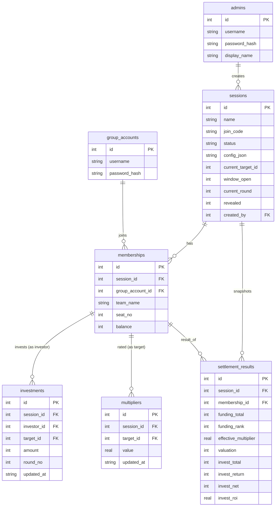

# 03 · 数据模型

金额一律用**整数(单位:元)**,不用浮点。倍率用 REAL,估值/收益四舍五入为整数元。

## ER 图

## 表说明

### admins —— 主办方账号(预置硬账号)
部署时由 seed 文件/环境变量种入,**无创建接口**,不开放注册。
- `username` UNIQUE,`password_hash`(bcrypt)。

### group_accounts —— 小组登录账号(自助注册)
- `username` UNIQUE,`password_hash`(bcrypt)。一个账号可在多个场次拥有 membership。

### sessions —— 场次
- `name`:主办方命名。
- `join_code`:UNIQUE,小组加入用(如 6 位字母数字)。
- `status`:`draft | open | running | settled | ended`。
- `config_json`:该场次全部配置的 JSON(键见 `06-config-parameters.md`)。
- 运行时字段:`current_target_id`(当前路演的 membership.id,可空)、`window_open`(0/1)、`current_round`(整数)、`revealed`(0/1)。
- `created_by` → admins.id。

### memberships —— 小组在某场次的参与("队")
- `team_name`:小组自定义队名。
- `seat_no`:第 N 组,加入时分配或主办方指定;每组的固定颜色按 seat_no 派生(见 UI 规格)。
- `balance`:当前可用虚拟资金(元),初始 = config.initial_funds。
- 约束:`UNIQUE(session_id, group_account_id)`、`UNIQUE(session_id, seat_no)`。

### investments —— 投资记录
- `investor_id` / `target_id` → memberships.id(同一 session 内)。
- `amount`:投给该 target 的累计金额(元)。
- 约束:`UNIQUE(session_id, investor_id, target_id)`(每个投资人对每个目标只有一条,窗口内可改)、`CHECK(investor_id <> target_id)`。
- `round_no`:产生该投资的回合。

### multipliers —— 评审倍率
- `target_id` → memberships.id;`value` REAL(范围由 config 的 multiplier_min/max 约束)。
- 约束:`UNIQUE(session_id, target_id)`。可在 running 阶段任意时间录入。

### settlement_results —— 结算快照
结算时一次性写入,保证揭榜稳定可复现。字段含义见 `04-business-logic.md` 的算法。
- 约束:`UNIQUE(session_id, membership_id)`。

## 鉴权令牌

用 JWT(无状态),payload 含 `role`(admin|group)、`sub`(账号 id)。无需 token 表。
