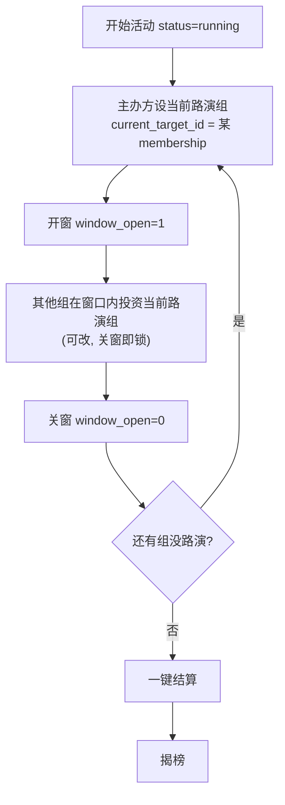

# 04 · 业务逻辑与结算规则

## 1. 回合流程(running 阶段)

10 个组每组路演一次,每次路演对应一个投资窗口:



评审倍率录入与上述回合**并行**:主办方可在任意时刻给任意组录倍率,结算时才套用"前 N 名才生效"的过滤。

## 2. 投资规则(服务端校验)

接受一笔投资(`PUT /investment`)的全部条件:

1. `session.status == 'running'` 且 `window_open == 1`。
2. `target_id == session.current_target_id`(只能投当前路演组)。
3. `investor_id != target_id`(除非 config.allow_self_invest=true)。
4. `amount` 是 config.invest_step 的整数倍,且 ≥ min_invest_per_tx、≤ max_invest_per_tx(若设)。
5. 不超过该组余额(除非 config.allow_overdraft=true)。即:新 amount 不能让该组总投出 > initial_funds。
6. 若设 max_invest_per_target,单组对单一目标累计不超过该上限。

行为:**upsert**(同一 investor→target 只有一条,窗口内可反复修改);余额 = initial_funds − Σ(该组所有 investments.amount)。关窗后该轮锁定。

> config.allow_hold=true 时,允许小组完全不投(保守策略合法)。

## 3. 结算算法(`POST /settle`)

记某组(membership)为 m。

```
# 1. 融资总额
funding_total[m] = Σ investments.amount  where target_id = m

# 2. 融资排名(降序),tie 规则见下
funding_rank[m] = rank of funding_total[m] desc

# 3. 生效倍率
if funding_rank[m] ∈ 前 bonus_top_n 名:
    eff_mult[m] = clamp(multiplier[m] 或 base_multiplier, multiplier_min, multiplier_max)
else:
    eff_mult[m] = base_multiplier      # 默认 1x

# 4. 项目最终估值
valuation[m] = round(funding_total[m] × eff_mult[m])

# 5. 作为投资人的回报
for 每个 membership i:
    invest_total[i] = Σ investments.amount where investor_id = i
    invest_return[i] = Σ over 每笔 i→j ( round(amount × eff_mult[j]) )
    invest_net[i]    = invest_return[i] − invest_total[i]
    invest_roi[i]    = invest_total[i] > 0 ? invest_net[i] / invest_total[i] : null
```

**化简(实现时按这个算)**:由
`投资人对某项目收益 = (投入/融资总额) × (融资总额 × 倍率) = 投入 × 倍率`,
所以单笔收益直接等于 `投入 × 该目标的生效倍率`,无需算占比。两种写法等价。

把以上结果写入 `settlement_results` 快照,置 `status=settled`。

## 4. 奖项

- **最会融资奖**:`funding_total` 最大的组。
- **最会投资奖**:`invest_roi` 最大的组(`invest_total=0` 的组**排除**,其 roi 为 null)。
- **韶音特别关注奖**:主办方手动指定(`POST /special-award`)。
- 各奖可由 config.awards 开关。
- 不计算"总资产"合并排名。(若前端想展示某组期末总资产 = 保留现金 balance + invest_return,可算但不用于排名。)

## 5. 平局与边界条件

- **融资额并列且跨越前 N 名边界**:并列的组**都**视为进入前 N 名、都享受加成(从宽处理,避免任意排除)。这意味着实际享加成的组数可能 > bonus_top_n。
- **某组融资总额 = 0**:valuation = 0,无人从它获得收益,正常。
- **某组一分没投**(invest_total=0):invest_roi = null,排除出最会投资奖。
- **ROI 并列**:依次比 invest_net 绝对值更大者、seat_no 更小者。
- **倍率缺失**:某前 N 名组未被录倍率时,用 base_multiplier 兜底。
- **多次结算**:settle 应可重入(重新计算并覆盖快照);揭榜后若需改,允许 re-settle 再 reveal。

## 6. 大屏揭榜内容(revealed=1 后)

- 融资榜:各组 funding_total 降序,前 N 名高亮 + 名次 + 奖牌。
- 投资收益榜:各组 invest_roi / invest_net 降序(若 config.reveal_show_roi)。
- 揭榜前,这些聚合一律不下发。
